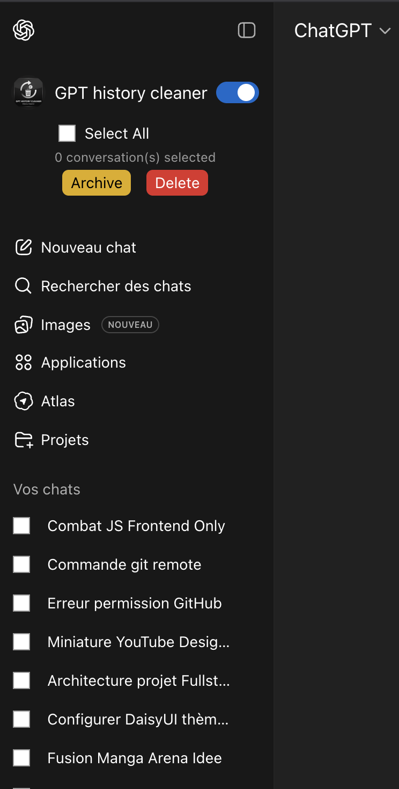
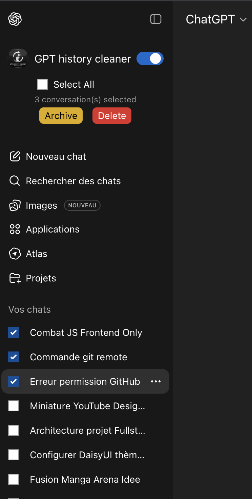

# 🧹 GPT History Cleaner

**GPT History Cleaner** is a Chrome extension that allows you to bulk delete or archive ChatGPT conversations directly from the sidebar, saving time and keeping your workspace clean.

 

## ✨ Features

- ✅ **Bulk selection** of ChatGPT conversations
- 🗑️ **Delete multiple conversations** at once
- 📦 **Archive conversations** in one click
- 🔍 **Works directly inside** the ChatGPT sidebar
- ⚡ **Fast & lightweight** — no performance impact
- 🔒 **Privacy-first** — no tracking, no analytics, no data collection
- 🌐 **100% local** — no external servers

---

## 📸 Screenshots

| Selection Mode | Bulk Actions | Clean Interface |
|----------------|--------------|-----------------|
|  |  |  |

---

## 🚀 Installation

### From Chrome Web Store (Recommended)
1. Visit the [Chrome Web Store page](#) 
2. Click **"Add to Chrome"**
3. Confirm the installation

### Manual Installation (Developer Mode)
1. Download or clone this repository
2. Open Chrome and go to `chrome://extensions/`
3. Enable **Developer mode** (top right)
4. Click **"Load unpacked"**
5. Select the extension folder
6. The extension is now installed!

---

## 🧭 How to Use

1. **Install the extension** (see above)
2. **Go to** [chatgpt.com](https://chatgpt.com)
3. **Open the left sidebar** (your conversation history)
4. **Look for the extension UI** at the top of the sidebar
5. **Toggle the switch** to enable selection mode
6. **Select conversations** by clicking on them
7. **Click "Delete" or "Archive"** to perform bulk actions

> **Note:** The extension operates directly inside the ChatGPT interface. Clicking the extension icon only displays the activation status.

---

## 🛡️ Privacy & Security

This extension is built with **privacy as a core principle**:

- ✅ **No data collection** — we don't collect, store, or transmit any personal information
- ✅ **No external servers** — all operations are performed locally in your browser
- ✅ **No tracking or analytics** — your usage data stays with you
- ✅ **Minimal permissions** — only accesses `chatgpt.com` when you're logged in
- ✅ **Open source** — the code is fully transparent and auditable

**We believe extensions should respect your privacy, not exploit it.**

---

## 🔐 Permissions Explained

The extension requests minimal permissions:

| Permission | Why it's needed |
|------------|-----------------|
| `host_permissions: "https://chatgpt.com/*"` | To inject the UI and interact with ChatGPT's conversation list |
| `scripting` | To execute code that adds checkboxes and handles bulk actions |

**That's it.** No access to cookies, no access to other websites, no unnecessary permissions.

---

## 🧪 Compatibility

- ✅ **Google Chrome** (Manifest V3)
- ✅ **ChatGPT Web Interface** (Free & Plus accounts)
- ✅ Works with the latest ChatGPT UI

---

## 🆚 Why This Extension?

Many similar extensions exist, but most of them:
- ❌ Use external servers (raising privacy concerns)
- ❌ Request excessive permissions (like reading your email)
- ❌ Include tracking or analytics
- ❌ Charge money for basic features

**GPT History Cleaner is different:**
- ✅ 100% local processing
- ✅ Minimal permissions
- ✅ No tracking whatsoever
- ✅ Completely free and open source

---

## 🛠️ Tech Stack

- **Manifest V3** (latest Chrome extension standard)
- **React** (for popup UI)
- **Vanilla JavaScript** (for content scripts)
- **Tailwind CSS** (for styling)

---

## 📝 Changelog

### v1.0.0 (2024-12-XX)
- 🎉 Initial release
- ✅ Bulk delete conversations
- 📦 Bulk archive conversations
- ⚡ Parallel processing for fast operations

---

## 🐛 Bug Reports & Feature Requests

Found a bug or have an idea for a new feature?

1. Visit my portfolio: [soleil-ouisol.fr](https://soleil-ouisol.fr)
2. Use the **contact form** to reach out
3. Or open an issue in this repository

Feedback is always welcome!

---

## 👨‍💻 About the Author

**Soleil OUISOL**  
Full-stack developer Next.js|Symfony passionate about building clean, useful, and user-friendly tools.

- 🌐 **Portfolio:** [soleil-ouisol.fr](https://soleil-ouisol.fr)
- 💼 **GitHub:** [Soleil-Clems](https://github.com/Soleil-Clems) 
- 📧 **Contact:** Available on my portfolio

---

## 📄 License

This project is licensed under the **MIT License**.  
Feel free to use, modify, and distribute this project.

See [LICENSE](LICENSE) for more details.

---

## ⭐ Support

If you find this extension useful, consider:
- ⭐ **Starring this repository** on GitHub
- 💬 **Leaving a review** on the Chrome Web Store
- 📣 **Sharing it** with others who might need it

---

## 🙏 Acknowledgments

- Thanks to the ChatGPT team for building an amazing product
- Inspired by the need for better conversation management tools
- Built with love for the community

---

**Made with ❤️ by [Soleil OUISOL](https://soleil-ouisol.fr)**

